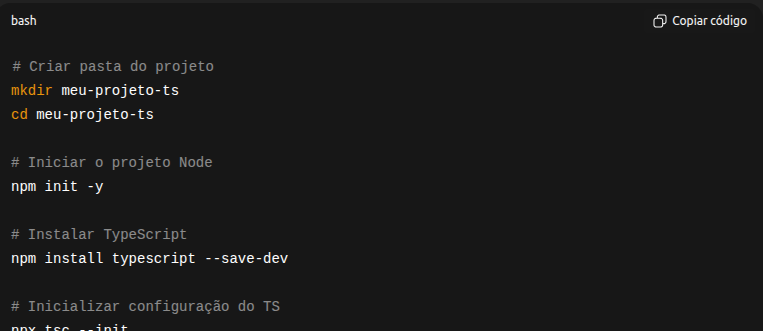

# Bd-Aluno-Aula-Prof-Edu

Integrantes do Grupo:

Gabriel Araujo Santos (2508678)
Leonardo da Graça Moraes (2512238)
Paulo André Silva de Lima (2512630)
Paulo Vitor Macieira Carvalho (2508725)

Proposta da Atividade: Criar uma aplicação em typescript capaz de calcular faltas e médias das notas em typescript, armazenando os alunos em CSV e os boletins em TXT. 

